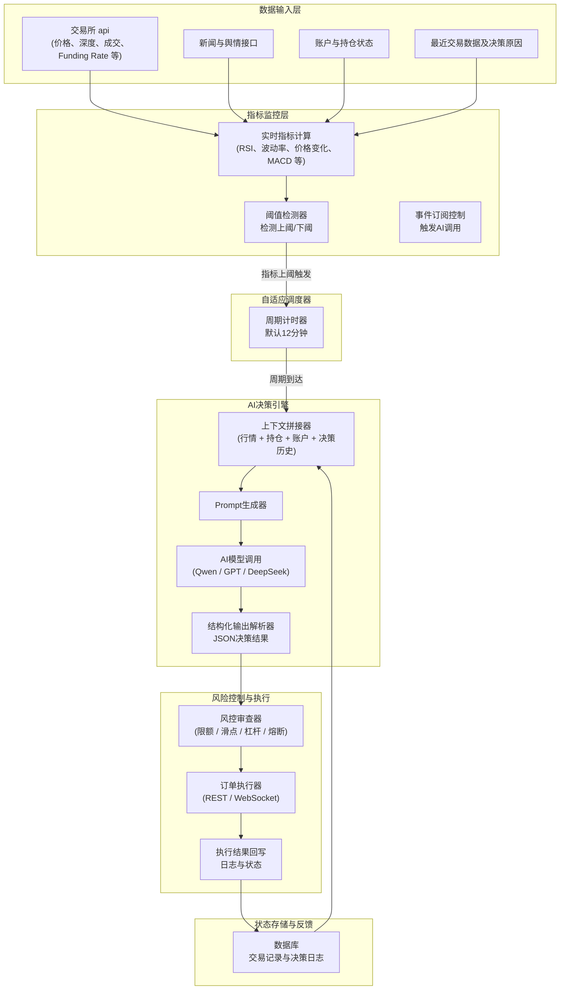
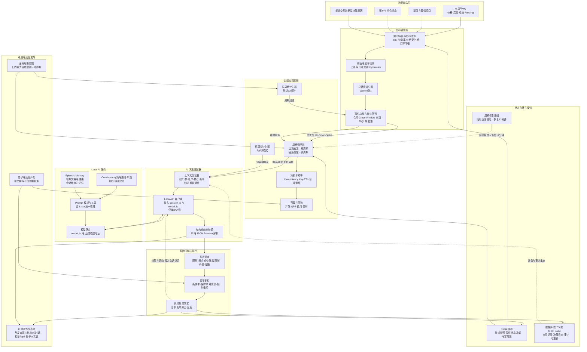

# OKX AI Trader

ai-trade-in-okx 集成okx api，通过ai策略进行自动化交易，支持永续合约交易。

## 功能特性

-  **AI自动交易**: 基于技术因子的AI决策系统
-  **手动交易**: Web界面手动下单和管理持仓
-  **实时数据**: WebSocket实时价格和账户数据推送
-  **多账户管理**: 支持多个OKX账户管理
-  **永续合约**: 支持BTC、ETH、SOL等主流币种永续合约
-  **数据持久化**: PostgreSQL存储交易记录和账户数据
-  **交易监控**: 实时监控持仓、订单和交易历史

## 技术栈

### 后端
- **FastAPI**: 高性能API服务
- **CCXT**: 加密货币交易所API统一接口
- **SQLAlchemy**: ORM数据库操作
- **PostgreSQL**: 生产级数据库
- **WebSocket**: 实时数据推送

### 前端
- **React 18**: 现代化UI框架
- **TypeScript**: 类型安全
- **Vite**: 快速构建工具
- **Tailwind CSS**: 实用优先的CSS框架
- **Recharts**: 数据可视化

## 快速开始

### 环境要求

- Node.js 18+
- Python 3.10+
- PostgreSQL 12+
- PNPM 包管理器

### 安装步骤

1. **克隆项目**
```bash
git clone https://github.com/machsh64/open-alpha-trade-in-okx.git
cd open-alpha-trade-in-okx
```

2. **启用PNPM**
```bash
corepack enable pnpm
```

3. **安装依赖**
```bash
pnpm install:all
```

4. **配置环境变量**

在 `backend/` 目录创建 `.env` 文件：

```env
# 数据库配置
DATABASE_URL=postgresql://username:password@ip:port/ai-trade

# AI交易配置（可选）
AI_TRADE_INTERVAL=1800  # AI交易检查间隔（秒），默认1800（30分钟）

# 代理配置（可选）：
# PROXY_URL=http://127.0.0.1:7890

# 其他可选配置
# 默认交易对类型 (spot: 现货, swap: 永续合约)
DEFAULT_TRADING_TYPE=swap

# 日志级别
LOG_LEVEL=INFO
```

5. **初始化数据库**
```bash
cd backend
uv run python init_database.py
```

6. **启动服务**

开发模式（同时启动前后端）所有环境通用：
```bash
pnpm dev
```

或分别启动：
```bash
# 仅后端 (端口 5611)
# Windows
pnpm run dev:backend:win

# Linux/Mac
pnpm run dev:backend:unix

# 仅前端 (端口 5621)
pnpm run dev:frontend
```

**注意**: 
- 项目使用内置的Python环境（`.conda/`目录），**无需额外安装Python**
- 首次运行前确保执行了 `pnpm install:all`
- 启动脚本会自动查找项目Python环境

7. **访问应用**

打开浏览器访问: http://localhost:5621

## 项目架构模式
### v-1.0.0 AI交易架构


### v-2.0.0 将要拓展的 自适应AI交易调度架构


## 项目结构

```
.
├── backend/                  # 后端服务
│   ├── api/                 # API路由
│   │   ├── okx_account_routes.py    # OKX账户API
│   │   ├── order_routes.py          # 订单管理
│   │   └── ws.py                    # WebSocket
│   ├── config/              # 配置文件
│   ├── database/            # 数据库连接和模型
│   ├── factors/             # 技术因子
│   ├── repositories/        # 数据访问层
│   ├── schemas/             # 数据模型
│   ├── services/            # 业务逻辑
│   │   ├── okx_market_data.py       # OKX市场数据
│   │   ├── auto_trader.py           # AI自动交易
│   │   └── order_executor.py        # 订单执行
│   ├── main.py              # FastAPI主入口
│   └── models.py            # SQLAlchemy模型
│
├── frontend/                # 前端应用
│   ├── app/
│   │   ├── components/      # React组件
│   │   │   ├── trading/     # 交易界面
│   │   │   ├── portfolio/   # 资产组合
│   │   │   └── layout/      # 布局组件
│   │   ├── lib/             # 工具函数和API
│   │   └── main.tsx         # 应用入口
│   └── vite.config.ts       # Vite配置
│
├── package.json             # 工作区配置
├── pnpm-workspace.yaml      # PNPM工作区
└── README.md               # 本文件
```

## 使用说明

### 手动交易

1. 点击左侧导航栏的 **Trade** 按钮
2. 选择交易对（BTC-USDT-SWAP, ETH-USDT-SWAP等）
3. 输入交易数量
4. 选择订单类型（市价/限价）
5. 点击 **Buy** 或 **Sell** 按钮下单

### AI自动交易

系统会定期运行AI决策引擎分析市场，在 **Arena** 页面可以查看：
- AI决策记录
- 持仓情况
- 订单历史
- 资产曲线

**AI交易特点**：
-  **检查频率**: 默认每30分钟检查一次市场（可通过环境变量 `AI_TRADE_INTERVAL` 调整）
-  **保守策略**: AI采用保守策略，**不会每次检查都交易**，只在有明确信号时才执行
-  **决策因素**: 基于市场价格、持仓情况、新闻资讯等多维度分析
- ️ **风险控制**: 
  - 单次交易不超过总资产的5-20%
  - 倾向于选择 `hold`（不交易）而非频繁操作
  - 避免过度集中单一币种

**调整AI交易频率**：

在 `backend/.env` 文件中添加：
```env
# AI交易检查间隔（秒）
AI_TRADE_INTERVAL=1800  # 30分钟（默认）
# AI_TRADE_INTERVAL=3600  # 1小时
# AI_TRADE_INTERVAL=7200  # 2小时
```

**注意**: 即使设置为30分钟检查一次，AI也经常会选择 `hold`（不交易），实际交易频率会更低。

### OKX账户查看

点击 **OKX** 按钮查看：
- 账户余额
- 当前持仓
- 未成交订单
- 历史交易记录

## 支持的交易对

- BTC-USDT-SWAP 
- ETH-USDT-SWAP 
- SOL-USDT-SWAP 
- DOGE-USDT-SWAP 
- XRP-USDT-SWAP 
- ADA-USDT-SWAP 
- AVAX-USDT-SWAP
- DOT-USDT-SWAP
- MATIC-USDT-SWAP 
- LTC-USDT-SWAP 

## 重要参数说明

### OKX永续合约参数

- **posSide**: 持仓方向
  - `long`: 做多（buy订单）
  - `short`: 做空（sell订单）

- **tdMode**: 交易模式
  - `cross`: 全仓模式（默认）
  - `isolated`: 逐仓模式

### 符号格式转换

系统自动处理以下格式转换：
- 输入: `BTC-USDT-SWAP` → 转换为: `BTC/USDT:USDT`
- 输入: `ETH-USDT-SWAP` → 转换为: `ETH/USDT:USDT`

## 开发命令

```bash
# 安装依赖
pnpm install
pnpm install:all

# 开发模式
pnpm dev

# 仅后端
pnpm run dev:backend

# 仅前端
pnpm run dev:frontend

# 构建生产版本
pnpm run build

# Python代码格式化
uv run black backend

# Python代码检查
uv run ruff check backend

# 运行测试
uv run pytest backend/tests
```

## 测试脚本

```bash
cd backend

# 测试数据库连接
uv run python test_db_connection.py

# 测试OKX账户
uv run python test_okx_account.py

# 测试OKX价格获取
uv run python test_okx_price.py

# 测试符号格式转换
uv run python test_symbol_format.py

# 测试WebSocket连接
uv run python test_websocket.py
```

## 常见问题

### 1. 数据库连接失败

检查 `.env` 文件中的 `DATABASE_URL` 是否正确，确保PostgreSQL服务运行中。

### 2. OKX API错误

- 检查API密钥是否正确
- 确认API权限包含交易权限
- 沙盒环境和生产环境的密钥不同

### 3. WebSocket连接失败

确保后端服务运行在 `http://localhost:5611`，前端会自动连接 `ws://localhost:5611/ws`。

### 4. 下单失败

- 检查账户余额是否充足
- 确认交易对格式正确（如 `BTC-USDT-SWAP`）
- 查看后端日志了解具体错误

## 安全建议

⚠️ **重要安全提示**

1. **不要提交 `.env` 文件到git**
2. **生产环境使用独立的API密钥**
3. **限制API密钥权限（只开启交易权限）**
4. **定期更换API密钥**
5. **启用OKX的IP白名单**
6. **小额测试后再大额交易**

## 许可证

MIT License

## 贡献

欢迎提交Issue和Pull Request！

## 联系方式

如有问题请提交Issue或联系项目维护者。

## 风险说明
任何使用本项目进行的交易行为均由使用者自行承担风险。加密货币市场波动较大，投资需谨慎。

---

**免责声明**: 本项目仅供学习和研究使用，使用本系统进行实盘交易的风险由使用者自行承担。加密货币交易存在高风险，可能导致资金损失。
